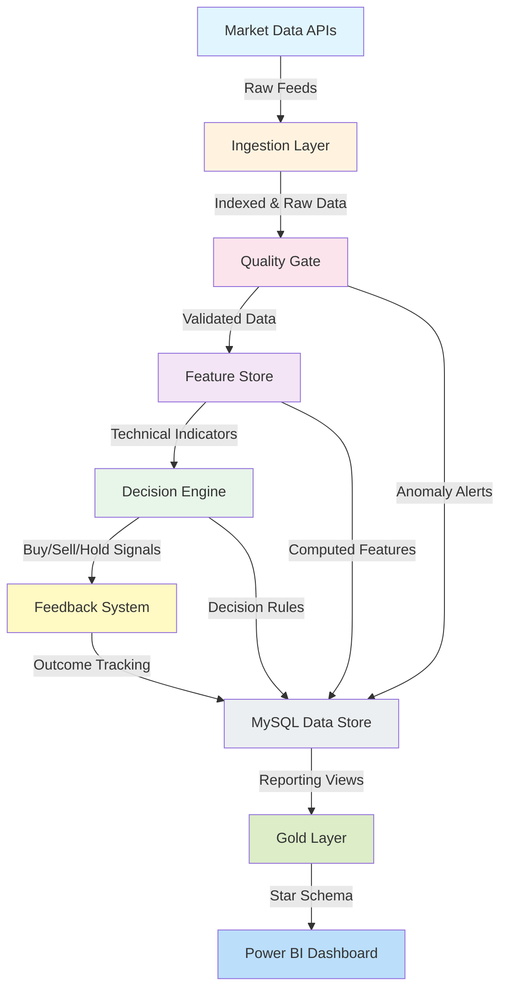
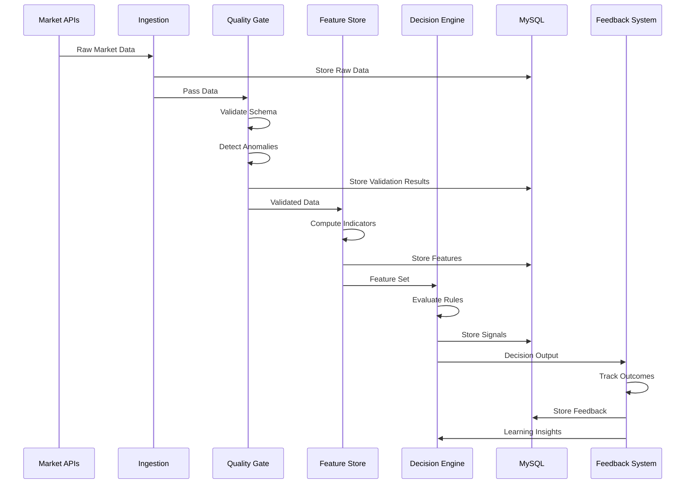
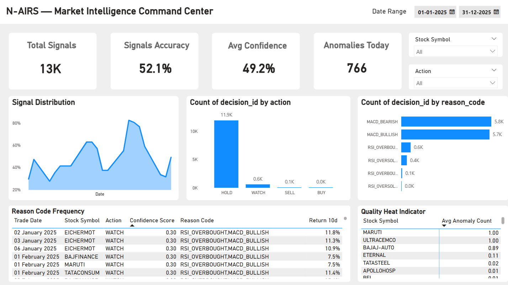
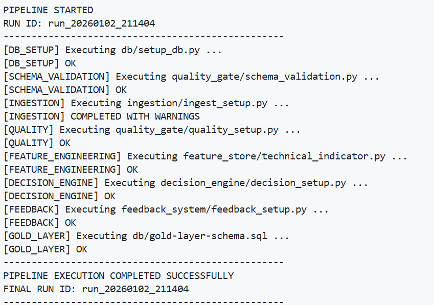
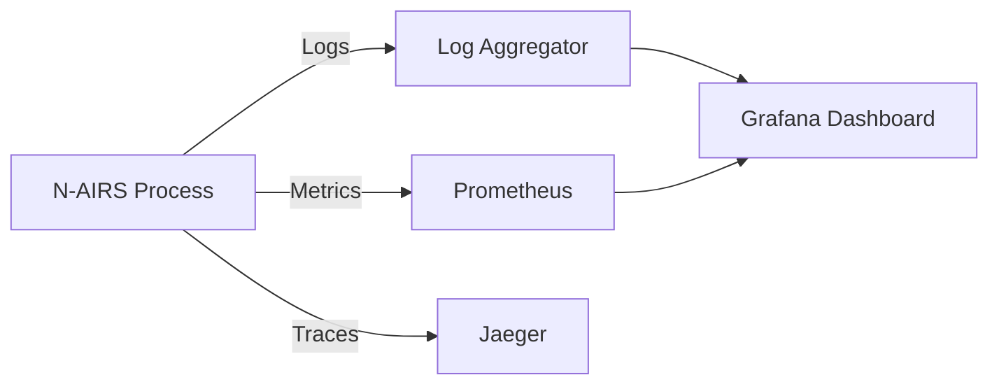

# **N-AIRS**

**Automated Market Intelligence & Rule-Based Decision Engine**


> **Status:** Pre-Production • Modular Architecture • Scalable for Cloud & CI/CD Integration  
> **Owner:** Prateek Kumar Prasad

---

## **Overview**

N-AIRS is a modular financial analytics system designed to automate market data ingestion, feature computation, signal generation, and outcome tracking.
The architecture emphasizes **separation of concerns**, **configuration-driven behavior**, **database-backed state**, and **production scalability**.

The objective is to create a system that can be integrated into:

* Quantitative trading strategies
* Market analysis platforms
* Signal intelligence dashboards
* Automated research systems

---

## **Architecture**



---

## **Key Capabilities**

| Module          | Description                                                      |
| --------------- | ---------------------------------------------------------------- |
| **Ingestion**   | Fetches and stores index & equity data at defined intervals      |
| **Quality Gate** | Schema validation, anomaly detection, and data integrity metrics |
| **Feature Store** | Computes technical indicators & engineered variables             |
| **Decision Engine** | YAML-driven rule evaluation for BUY/SELL/HOLD outcomes           |
| **Feedback System** | Tracks realized outcomes for reinforcement & strategy review     |

---

## **Project Structure**

```
N-AIRS/
 ├── config/              # Environment & DB configuration
 ├── db/                  # Schema, migrations, setup scripts
 ├── ingestion/           # Data fetchers, loaders
 ├── quality_gate/        # Validation & anomaly detection
 ├── feature_store/       # Technical indicators & features
 ├── decision_engine/     # Rule processing & signal generation
 ├── feedback_system/     # Outcome capture & learning
 ├── run_pipeline.py      # Unified pipeline entrypoint
 ├── requirements.txt     # Dependencies
 └── README.md            # Project documentation
```

---

## **Data Flow (Detailed)**



---

## **Environment Setup**

### **Prerequisites**

* Python **3.10+**
* MySQL **8+**
* Git

### **Installation**

```bash
git clone https://github.com/prateekkp/N-AIRS.git
cd N-AIRS
python -m venv .venv

# Windows
.venv\Scripts\activate

# macOS / Linux
source .venv/bin/activate

pip install -r requirements.txt
```

---

## **Configuration**

#### **config.yml**

```yaml
mysql:
  host: "" # e.g., "localhost" 
  user: "" # e.g., "root"
  password: "" # e.g., "password"
  database: "NAIRS"

market_data:
  index_symbol: "^NSEI"
  index_name: "NIFTY 50"
  start_date: "2020-01-01"
  end_date: "today"
  interval: "1d"

ingestion:
  run_id_nifty_prefix: "NIFTY_INGEST"
  run_id_stock_prefix: "STOCK_INGEST"

url:
  company_list: "https://archives.nseindia.com/content/indices/ind_nifty50list.csv"
```

⚠️ **Security**: Do **not** commit actual credentials.  


---


## **Pipeline Execution**

### **Full Pipeline**

```bash
python run_pipeline.py
```

- Gold Layer publish: the pipeline now executes [db/gold-layer-schema.sql](db/gold-layer-schema.sql) as the final step to materialize the reporting views (`fact_signals`, `dim_calendar`, `dim_stocks`, `rpt_quality_summary`) consumed by Power BI.

### **Individual Module Execution**

```bash
# Database Setup
python db/setup_db.py

# Ingestion only
python ingestion/ingest_setup.py

# Quality checks
python quality_gate/quality_setup.py

# Feature computation
python feature_store/technical_indicator.py

# Decision generation
python decision_engine/decision_setup.py

# Feedback capture
python feedback_system/feedback_setup.py
```

---

## **Artifacts & Outputs**
- Power BI report: [artifacts/dashboard/nairs_decision_engine.pbix](artifacts/dashboard/nairs_decision_engine.pbix)
- Dashboard preview (PNG): [artifacts/outputs/nairs_decision_engine.png](artifacts/outputs/nairs_decision_engine.png)
- Recent terminal run log (screenshot): [artifacts/outputs/Terminal-Execution.png](artifacts/outputs/Terminal-Execution.png)

**Previews**





---

## **Module Reference**

### **Ingestion Layer**
- `stock_raw_data.py` — Fetches equity prices
- `index_raw_data.py` — Fetches index prices
- `ingest_setup.py` — Initializes data fetchers

### **Quality Gate**
- `schema_validation.py` — Validates data structure
- `anomaly_detection_raw.py` — Detects outliers in raw data
- `anomaly_detection_index.py` — Detects index anomalies
- `quality_setup.py` — Configures thresholds

### **Feature Store**
- `technical_indicator.py` — Computes RSI, MACD, Bollinger Bands, etc.

### **Decision Engine**
- `rules.py` — Defines trading rules
- `scorer.py` — Evaluates signals against rules
- `writer.py` — Writes decisions to database
- `config.yml` — YAML-based rule definitions

### **Reporting Layer**
- Gold Layer contract: [docs/gold_layer.md](docs/gold_layer.md)
- Power BI dashboard spec: [docs/powerbi_dashboard.md](docs/powerbi_dashboard.md)

### **Feedback System**
- `raw_prices_feedback.py` — Tracks outcome vs. prediction (raw data)
- `index_prices_feedback.py` — Tracks outcome vs. prediction (index data)
- `feedback_setup.py` — Initializes feedback system

---

## **Performance & Monitoring**

### **Expected Metrics**

* Ingestion: ~500 records/min per worker
* Quality Gate: ~10ms per record validation
* Feature Computation: ~5ms per indicator per record
* Decision Evaluation: <1ms per rule per signal

### **Observability Stack**



---

## **Troubleshooting**

| Issue | Solution |
| --- | --- |
| Database connection fails | Verify MySQL running, credentials correct, network access |
| Missing technical indicators | Check feature_store config, ensure sufficient historical data |
| Decision rules not firing | Validate YAML syntax in decision_engine/config.yml |
| Data anomalies flagged | Review quality_gate thresholds, check source data quality |

---

## **Contributing**

1. Fork the repository
2. Create a feature branch: `git checkout -b feature/your-feature`
3. Commit changes: `git commit -m "Add feature description"`
4. Push to branch: `git push origin feature/your-feature`
5. Submit pull request

**Code review required before merge.**

---

## **License**

MIT License — Free for educational and research use.

See `LICENSE` file for full details.

---

## **Contact & Support**

**Maintainer:** Prateek Kumar Prasad  
**Email:** [prateekkumarprasad15@gmail.com](mailto:prateekkumarprasad15@gmail.com)  
**Status:** Active development  
**Last Updated:** January 2026

---

## **References**

- [Technical Analysis Indicators](https://en.wikipedia.org/wiki/Technical_analysis)
- [YAML Configuration Format](https://yaml.org/spec/1.2/spec.html)
- [MySQL Documentation](https://dev.mysql.com/doc/)
- [Python Best Practices](https://pep8.org/)

---

> *Prepared with the precision of an operations briefing.*  
> *If it's not clear, it's not deployable.*  
> **Ready for deployment. Executing mission. 🫡**
